# Test-suite architecture

```mermaid
flowchart TD
    CLI[CLI and JSON configuration] --> RESOLVE[Adapter resolver]
    RESOLVE --> DETECT[Configured paths / environment / PATH / known locations]
    DETECT -->|found| PROBE[Version and live probes]
    DETECT -->|missing| CUSTOM[Custom-path prompt]
    CUSTOM -->|valid| PROBE
    CUSTOM -->|not supplied| INSTALL[Consent-gated installer]
    INSTALL -->|resolved| PROBE
    INSTALL -->|unresolved| BLOCKED[Explicit BLOCKED result]

    CLI --> INVENTORY[Toolkit surface inventory]
    INVENTORY --> CATALOG[Version-pinned catalog audit]
    CATALOG --> COMMANDS[72 CLI parse tests]
    CATALOG --> FUNCTIONS[394 function/method body audit]
    CATALOG --> CONTRACTS[38 schemas + 3 Ghidra scripts + workflow states]

    CLI --> CORE[Core verification suites]
    CORE --> STRUCTURE[Hashes / schemas / skill / Java / compileall]
    CORE --> PYTEST[Native + supplemental regression tests]
    CORE --> COVERAGE[Statement / branch / all-function execution]
    CORE --> PACKAGE[Wheel + sdist + clean installation]
    CORE --> SELF[Harness self-tests]
    CORE --> PROBE

    COMMANDS --> RESULTS[Unified result model]
    FUNCTIONS --> RESULTS
    CONTRACTS --> RESULTS
    STRUCTURE --> RESULTS
    PYTEST --> RESULTS
    COVERAGE --> RESULTS
    PACKAGE --> RESULTS
    SELF --> RESULTS
    PROBE --> RESULTS
    BLOCKED --> RESULTS

    RESULTS --> JSON[results.json]
    RESULTS --> MD[REPORT.md]
    RESULTS --> HTML[report.html]
    RESULTS --> EVENTS[events.jsonl]
    RESULTS --> LOGS[Per-test stdout/stderr]
    RESULTS --> EXIT[Strict release-gate exit code]
```

## Separation of concerns

- `config.py`: configuration serialization and path resolution.
- `models.py`: immutable adapter/test records and run-level exit policy.
- `adapters/catalog.py`: declarative adapter definitions only.
- `adapters/detection.py`: discovery and version probing only.
- `adapters/installation.py`: consent and installer orchestration only.
- `adapters/download.py`: bounded network and safe archive handling only.
- `inventory.py`: source/CLI/schema/Ghidra/function discovery and drift comparison.
- `coverage_audit.py`: AST-to-coverage correlation.
- `suites.py`: structural, CLI, pytest, coverage, self-test, and packaging phases.
- `live_adapters.py`: real integration probes for resolved external tools.
- `process.py`: process isolation, timeout handling, and per-test logs.
- `logging_utils.py`: human text log and machine JSONL event stream.
- `reports.py`: JSON, Markdown, and HTML projections of the same result model.
- `orchestrator.py`: phase ordering; it does not implement individual tests.
- `cli.py`: user interface only.

No phase owns project truth. Each phase emits a `TestResult`, and only the run summary computes the final exit code.
