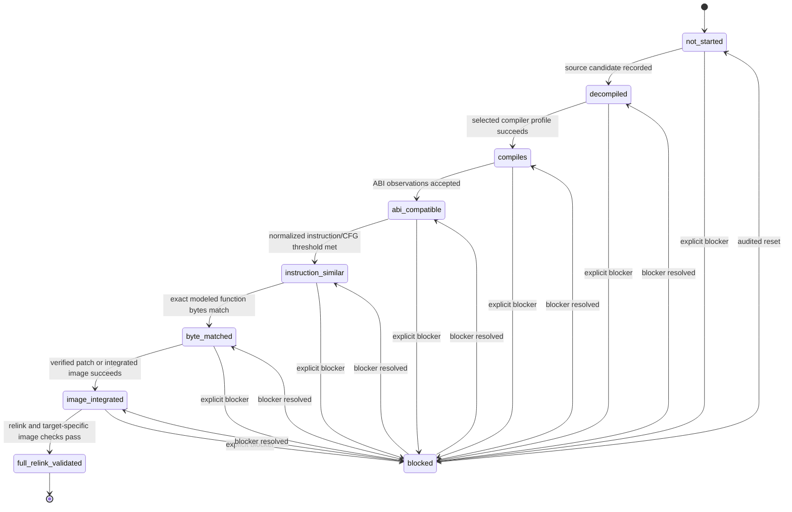
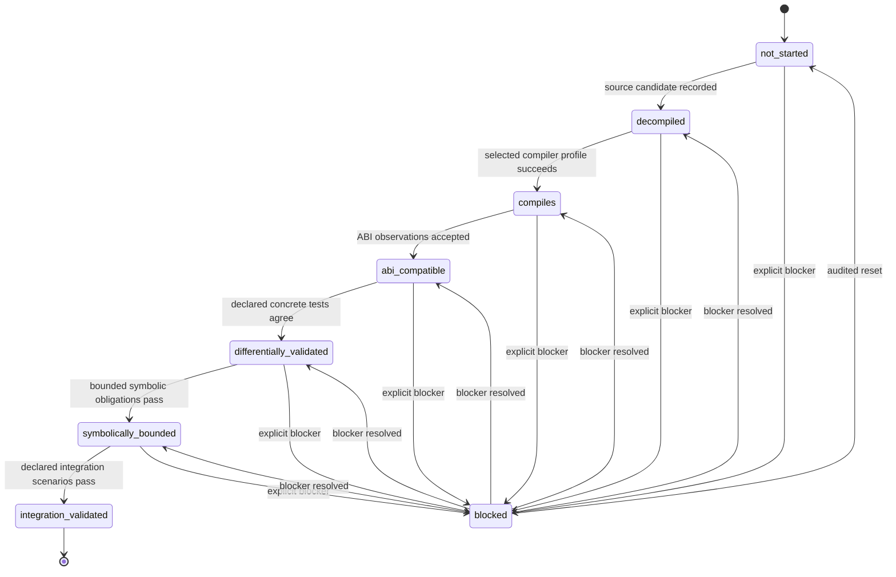

# x86decomp-toolkit Architecture Map

**Architecture version:** 0.3.0  
**Suggested repository path:** `docs/ARCHITECTURE_MAP.md`  
**Status:** Describes the implemented v0.3.0 architecture and workflow contracts.

## Purpose

This document is the visual architecture source of truth for the toolkit. It shows the implemented data flow, ownership boundaries, matching-decompilation lane, functional-decompilation lane, and the feedback path into evidence, claims, workflow state, and project memory.

The two decompilation modes are tracked independently for every function. A function can be functionally validated without being byte-matched, or byte-matched without having completed every functional validation stage.

## Actual v0.3.0 architecture

```mermaid
flowchart TB
    subgraph INPUTS["Authorized inputs"]
        PE["Primary PE image<br/>PE32 x86 or PE32+ x86-64<br/>EXE or DLL"]
        SUPPORT["Optional evidence<br/>PDB · linker MAP · OBJ/bigobj<br/>LIB/A archive · source · toolchain metadata<br/>reference/rebuilt image"]
        BUNDLE["Authorized test bundle<br/>declared artifacts and authorization"]
    end

    subgraph INGEST["Immutable ingestion and evidence sealing"]
        AUTH["Authorization and supported-scope checks"]
        HASH["SHA-256 content identity<br/>immutable evidence copies"]
        SAFE["Path confinement · archive limits<br/>no implicit native execution"]
        MANIFEST["Bounded format manifests<br/>provenance and parser diagnostics"]
    end

    PE --> AUTH
    SUPPORT --> AUTH
    BUNDLE --> AUTH
    AUTH --> HASH --> SAFE --> MANIFEST

    subgraph FORMAT["Binary, linker, and metadata analysis"]
        PEP["PE/PDB analysis<br/>sections · directories · imports/exports<br/>resources · TLS · relocations · CodeView<br/>PDB identity/modules/contributions"]
        COFF["COFF and linker evidence<br/>classic COFF · bigobj · relocations<br/>aux records · weak externals · COMDAT<br/>archives · import objects · linker MAP"]
        CPP["Windows C++ metadata<br/>RTTI · class hierarchy · PMD<br/>vtable candidates · x64 unwind/EH<br/>x86 SafeSEH · TLS · CRT initializers"]
    end

    MANIFEST --> PEP
    MANIFEST --> COFF
    MANIFEST --> CPP

    subgraph STATIC["Static-analysis plane"]
        GHIDRA["Ghidra primary analysis<br/>discontiguous bodies · exact bytes<br/>rendered C · token tree<br/>raw P-code · high P-code<br/>symbols · types · references"]
        DECODER["Independent Capstone decoder<br/>x86/x64 instructions · operands<br/>branch targets · CFG edges<br/>Ghidra disagreement detection"]
        MCP["Evidence-gated Ghidra MCP adapter<br/>read-only by default<br/>hash-approved mutation transactions"]
    end

    PEP --> GHIDRA
    CPP --> GHIDRA
    GHIDRA --> DECODER
    GHIDRA <--> MCP

    subgraph CONTROL["Project control plane"]
        ARTIFACTS["Immutable artifact store<br/>original ranges · Ghidra exports<br/>compiler outputs · validator reports"]
        DB["Global SQLite analysis database<br/>entities · symbols · references<br/>ABI observations · type/field constraints<br/>provenance · conflicts"]
        WORKFLOW["Per-function workflow<br/>active candidate · compiler profile<br/>matching state · functional state<br/>reports · blockers · evidence links"]
        GOVERN["Governance<br/>evidence records · claims · contradictions<br/>three-independent-source gate<br/>work queue · MCP journal"]
        MEMORY["Hash-chained project memory<br/>durable audited transitions"]
    end

    PEP --> ARTIFACTS
    COFF --> ARTIFACTS
    CPP --> ARTIFACTS
    GHIDRA --> ARTIFACTS
    DECODER --> ARTIFACTS
    PEP --> DB
    COFF --> DB
    CPP --> DB
    GHIDRA --> DB
    DECODER --> DB
    ARTIFACTS --> WORKFLOW
    DB --> WORKFLOW
    WORKFLOW <--> GOVERN
    GOVERN --> MEMORY

    subgraph CANDIDATE["Candidate-generation plane"]
        RAW["Original function bytes"]
        ASM["Exact assembly fallback"]
        DECOMP["Ghidra-derived C/C++ candidate"]
        CORRECTED["Human/AI-corrected candidate<br/>proposal is not evidence"]
        SELECTED["Selected per-function candidate"]
        HYBRID["Continuously buildable hybrid tree"]
        DECOMPME["Local decomp.me-style packet"]
    end

    WORKFLOW --> RAW
    RAW --> ASM
    RAW --> DECOMP
    DECOMP --> CORRECTED
    ASM --> SELECTED
    CORRECTED --> SELECTED
    SELECTED --> HYBRID
    SELECTED --> DECOMPME

    subgraph BUILD["Compiler and linker plane"]
        PROFILES["Compiler profiles and user-owned toolchains<br/>version · executable hash · flags · environment"]
        LAB["Compiler laboratory<br/>isolated builds · caching · flag matrices<br/>24-case x86/x64 ground-truth corpus<br/>cross-version reports"]
        OBJ["Candidate COFF objects<br/>symbol extraction · relocations · COMDAT"]
        SYNTH["Synthetic COFF reconstruction"]
        PATCH["Hash-gated PE patch backend<br/>checksum regeneration"]
        RELINK["Manifest-driven relink backend<br/>declared object/layout decisions"]
    end

    SELECTED --> PROFILES --> LAB --> OBJ
    COFF --> SYNTH
    OBJ --> SYNTH
    HYBRID --> PATCH
    OBJ --> RELINK
    SYNTH --> RELINK

    subgraph MATCH["Matching-decompilation lane"]
        MCOMPILE["Candidate compiles"]
        MABI["ABI and stack/register observations"]
        EXEDIFF["PE function ↔ COFF symbol comparison"]
        NORM["Relocation/address normalization"]
        ICFG["Instruction and CFG comparison"]
        OBJDIFF["Manifest-driven objdiff adapter"]
        BYTE["Exact function-byte match"]
        IMAGE["Verified image integration"]
        WHOLE["Target-specific whole-image match<br/>declared normalization profile"]
    end

    OBJ --> MCOMPILE --> MABI --> EXEDIFF --> NORM --> ICFG --> OBJDIFF --> BYTE
    BYTE --> PATCH --> IMAGE
    IMAGE --> RELINK --> WHOLE

    subgraph FUNCTIONAL["Functional-decompilation lane"]
        FCOMPILE["Candidate compiles"]
        FABI["ABI observations"]
        UNICORN["Unicorn differential execution<br/>declared register/memory harness"]
        DRCOV["DynamoRIO observed coverage"]
        Z3["Bounded Capstone/Z3 comparison<br/>explicit steps and observations"]
        ANGR["Optional angr memory/alias model<br/>declared regions and finite aliases"]
        INTEGRATION["Application integration scenarios<br/>exit · streams · declared files"]
        ACCEPT["Declared behavioral acceptance"]
    end

    OBJ --> FCOMPILE --> FABI --> UNICORN
    UNICORN --> DRCOV
    UNICORN --> Z3
    Z3 --> ANGR
    DRCOV --> INTEGRATION
    ANGR --> INTEGRATION --> ACCEPT

    subgraph FEEDBACK["Acceptance, evidence, and feedback"]
        REPORT["Validator report<br/>bounded observation, not automatic fact"]
        EVIDENCE["Evidence record with hashes and provenance"]
        CLAIM["Claim gate and contradiction check"]
        TRANSITION["Audited workflow transition"]
        REWORK["Return to analysis, typing,<br/>candidate correction, or compiler search"]
    end

    WHOLE --> REPORT
    ACCEPT --> REPORT
    ICFG --> REPORT
    UNICORN --> REPORT
    Z3 --> REPORT
    INTEGRATION --> REPORT
    REPORT --> EVIDENCE --> CLAIM
    CLAIM -->|"accepted"| TRANSITION --> WORKFLOW
    CLAIM -->|"insufficient or contradictory"| REWORK
    REWORK --> DB
    REWORK --> CANDIDATE
```



## Actual matching-state path



## Actual functional-state path



## Independent per-function modes

Matching and functional status must never be collapsed into a single `decompiled` or `complete` flag.

Example:

```yaml
function: pe-rva:00427060
matching:
  state: instruction_similar
functional:
  state: integration_validated
```

This means the candidate has passed the declared functional scenarios, but it has not reproduced the original machine code exactly.

## Ownership and trust boundaries

- Immutable evidence is never rewritten by a validator, agent, MCP server, compiler, or analysis backend.
- Ghidra is the primary decompiler, but its output is an analysis observation rather than recovered original source.
- Capstone is an independent decoder, not a type-recovery or equivalence authority.
- AI and human proposals enter the candidate/work-queue path; they are not evidence by themselves.
- Matching reports and functional reports are recorded separately.
- A bounded symbolic result applies only to its declared instruction, path, memory, alias, and observation limits.
- A target-specific whole-image result applies only to its hash-bound image profile and declared normalizations.
- Workflow promotion requires named reports, evidence provenance, contradiction checks, and an audited transition.

## Maintenance contract for future releases

This document must be updated in every release that changes any of the following:

1. A subsystem is added, removed, split, merged, or renamed.
2. A command changes the implemented data flow.
3. A new input or artifact format is supported.
4. Matching or functional workflow states change.
5. A validator, compiler, linker, runtime, or MCP trust boundary changes.
6. A new external dependency becomes required or optional.
7. The project database, evidence gate, work queue, or memory ownership changes.
8. A formerly external adapter becomes package-native, or the reverse.

Release procedure:

- Update `Architecture version` at the top of this file.
- Update the main Mermaid architecture diagram.
- Update both state diagrams if their enums or transitions changed.
- Compare the diagram against CLI commands, schemas, workflow constants, and `FEATURE_PARITY.md`.
- Add or update a regression test that verifies documented state names match runtime state enums.
- Record the change in `CHANGELOG.md` and `PROJECT_MEMORY.md`.
- Do not label a subsystem implemented solely because an adapter, schema, or documentation entry exists; the diagram must reflect executable behavior and clearly identify external integrations.
