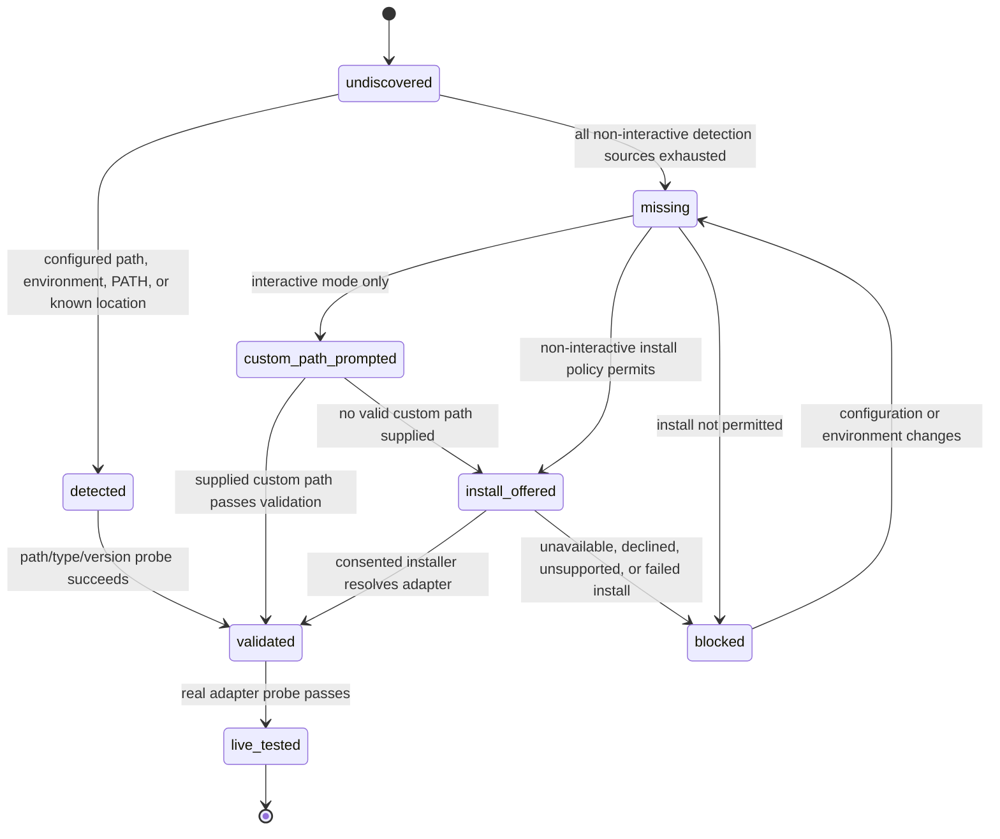

# x86decomp Comprehensive Test-Suite Architecture Map

**Architecture version:** 0.3.1  
**Canonical Mermaid path:** `test-suite/docs/ARCHITECTURE_MAP.md`  
**Canonical ASCII sibling:** `test-suite/docs/ARCHITECTURE_MAP_ASCII.txt`  
**Status:** Describes the implemented v0.3.1 verification-harness architecture.

## Purpose

This is the visual source of truth for the integrated test suite. It shows adapter
detection and resolution, exact toolkit-surface inventory, structural and behavioral
verification, live external-tool probes, result aggregation, detailed logging, and the
strict release gate.

A missing adapter is never silently skipped. It is recorded as `BLOCKED`; strict mode
fails the release gate until every release-required adapter is resolved and its live
probe runs.

## Actual v0.3.1 test-suite architecture

```mermaid
flowchart TB
    subgraph INPUTS["Operator and release inputs"]
        CLI["x86decomp-test CLI"]
        CONFIG["JSON configuration<br/>toolkit root · output root · consent flags<br/>custom environment · coverage floors"]
        TOOLKIT["Toolkit source or installed release<br/>modules · CLI · schemas · Ghidra scripts<br/>tests · packages · manifests"]
        CONSENT["Explicit permissions<br/>network · installation · host execution"]
    end

    CLI --> CONFIG
    CONFIG --> CONSENT
    CONFIG --> TOOLKIT

    subgraph ADAPTERS["Adapter resolution plane"]
        CATALOG["Declarative adapter catalog<br/>required commands/modules · probes · installers"]
        DETECT["Detection order<br/>saved path → environment → PATH<br/>→ known platform locations"]
        FOUND{"Adapter found?"}
        VERIFY["Path/type validation<br/>version capture · executable/module identity"]
        CUSTOM["Prompt for custom path<br/>only when detection failed"]
        INSTALL["Consent-gated installer<br/>safe package manager or official archive"]
        BLOCKED["Explicit BLOCKED adapter result<br/>never counted as pass or hidden skip"]
        LIVE["Real live adapter probe<br/>bounded work fixture · stdout/stderr · timeout"]
    end

    CONFIG --> CATALOG --> DETECT --> FOUND
    FOUND -->|yes| VERIFY --> LIVE
    FOUND -->|no| CUSTOM
    CUSTOM -->|valid path| VERIFY
    CUSTOM -->|not supplied or invalid| INSTALL
    CONSENT --> INSTALL
    INSTALL -->|resolved| VERIFY
    INSTALL -->|unresolved| BLOCKED

    subgraph INVENTORY["Pinned surface and drift plane"]
        DISCOVER["Discover current toolkit surface"]
        MODULES["Python modules and all defined functions/methods"]
        COMMANDS["CLI commands and parser surfaces"]
        CONTRACTS["JSON Schemas · workflow states<br/>Ghidra scripts · architecture artifacts"]
        PINNED["Version-pinned feature catalog"]
        DRIFT{"Exact catalog match?"}
        DRIFTFAIL["Catalog drift failure<br/>review required; never auto-accepted"]
    end

    TOOLKIT --> DISCOVER
    DISCOVER --> MODULES
    DISCOVER --> COMMANDS
    DISCOVER --> CONTRACTS
    MODULES --> DRIFT
    COMMANDS --> DRIFT
    CONTRACTS --> DRIFT
    PINNED --> DRIFT
    DRIFT -->|no| DRIFTFAIL

    subgraph CORE["Built-in verification suites"]
        STRUCTURE["Structure and integrity<br/>SHA-256 manifests · archive hygiene<br/>schema meta-validation · skill frontmatter"]
        SYNTAX["Static validity<br/>compileall · Java syntax · config parsing"]
        CLIPARSE["Every CLI command parse/help test"]
        REGRESSION["Native toolkit regression tests"]
        SUPPLEMENTAL["Supplemental API/internal-helper tests"]
        COVERAGE["Statement/branch coverage<br/>AST-to-runtime body correlation"]
        NOSKIP["JUnit zero-skip enforcement"]
        PACKAGE["Wheel + sdist build<br/>clean virtual-environment installation<br/>installed CLI/API probes"]
        SELF["Test-harness self-tests"]
        MAPSYNC["Architecture-map synchronization<br/>Mermaid + ASCII · toolkit + test suite"]
    end

    DRIFT -->|yes| STRUCTURE
    TOOLKIT --> STRUCTURE
    STRUCTURE --> SYNTAX --> CLIPARSE
    CLIPARSE --> REGRESSION --> SUPPLEMENTAL --> COVERAGE --> NOSKIP
    NOSKIP --> PACKAGE --> SELF --> MAPSYNC

    subgraph EXECUTION["Safe process execution and observability"]
        RUNNER["Process runner<br/>argument arrays · isolated workdirs<br/>timeouts · return codes"]
        STDOUT["Per-test stdout.log"]
        STDERR["Per-test stderr.log"]
        EVENTS["Machine event stream<br/>events.jsonl"]
        HUMANLOG["Human run.log"]
    end

    LIVE --> RUNNER
    STRUCTURE --> RUNNER
    SYNTAX --> RUNNER
    CLIPARSE --> RUNNER
    REGRESSION --> RUNNER
    SUPPLEMENTAL --> RUNNER
    PACKAGE --> RUNNER
    SELF --> RUNNER
    RUNNER --> STDOUT
    RUNNER --> STDERR
    RUNNER --> EVENTS
    RUNNER --> HUMANLOG

    subgraph RESULTS["Unified results and release gate"]
        MODEL["Immutable TestResult records<br/>PASS · FAIL · ERROR · BLOCKED"]
        JSON["results.json · adapters.json<br/>inventory.json · catalog-audit.json"]
        JUNIT["junit.xml · harness-junit.xml"]
        COV["coverage.json/xml/html<br/>all-function coverage report"]
        REPORTS["REPORT.md · report.html"]
        STRICT{"Strict gate"}
        SUCCESS["Exit 0<br/>no failures/errors and no forbidden blockers"]
        FAILURE["Exit 1<br/>FAIL or ERROR"]
        BLOCKEXIT["Exit 2<br/>unresolved BLOCKED integration in strict mode"]
    end

    DRIFTFAIL --> MODEL
    BLOCKED --> MODEL
    LIVE --> MODEL
    MAPSYNC --> MODEL
    STDOUT --> MODEL
    STDERR --> MODEL
    MODEL --> JSON
    MODEL --> JUNIT
    MODEL --> COV
    MODEL --> REPORTS
    MODEL --> STRICT
    STRICT -->|all required checks pass| SUCCESS
    STRICT -->|failure or error| FAILURE
    STRICT -->|strict blocker remains| BLOCKEXIT

    subgraph FEEDBACK["Release maintenance feedback"]
        UPDATE["Update catalog, tests, adapters,<br/>maps, contracts, changelogs, verification"]
        REVIEW["Human review of intentional surface change"]
    end

    DRIFTFAIL --> REVIEW --> UPDATE --> PINNED
    FAILURE --> UPDATE
    BLOCKEXIT --> UPDATE
```

## Adapter-resolution state path

## Trust and separation boundaries

- Detection does not install.
- Installation does not declare a live probe successful.
- A detected path must pass type/version validation before use.
- A missing adapter is represented as `BLOCKED`, never as `PASS` or an omitted test.
- The inventory catalog is reviewed data; the release gate never rewrites it automatically.
- Process execution owns timeouts and logs, not pass/fail semantics.
- Individual suites emit `TestResult` records; only the run summary computes the exit code.
- Network, installation, and host execution each require separate explicit consent.
- Proprietary historical toolchains are user-owned custom-path integrations and are not downloaded or redistributed.

## Synchronization contract

The following four artifacts form one release documentation contract:

1. `docs/ARCHITECTURE_MAP.md`
2. `docs/ARCHITECTURE_MAP_ASCII.txt`
3. `test-suite/docs/ARCHITECTURE_MAP.md`
4. `test-suite/docs/ARCHITECTURE_MAP_ASCII.txt`

Any release that changes commands, modules, adapters, workflow states, trust boundaries,
result states, installation policy, coverage rules, or subsystem ownership must update
all affected diagrams in the same change and add or update a regression check.
