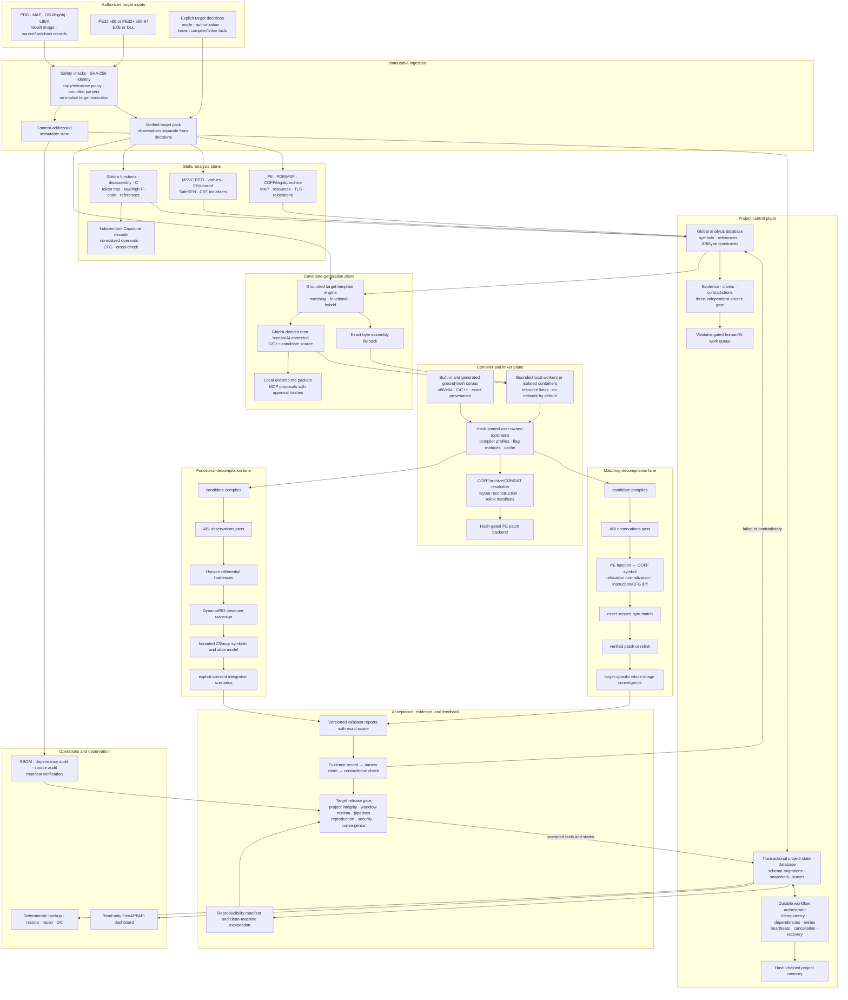
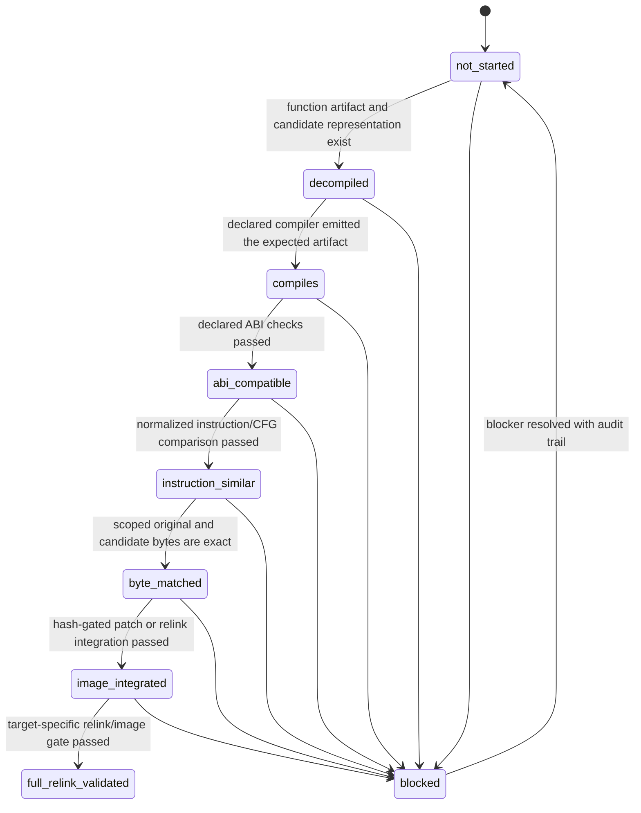
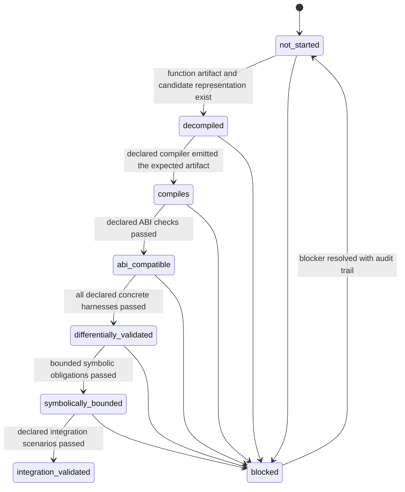
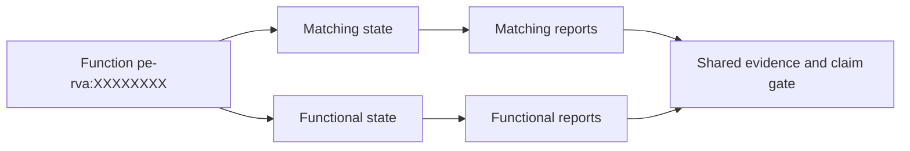
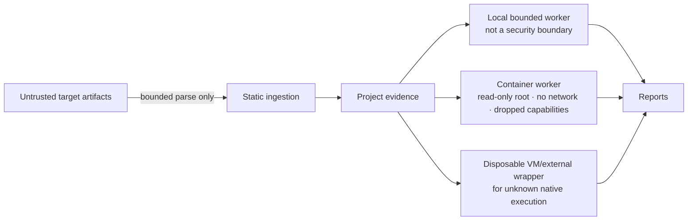

# x86decomp-toolkit architecture map

**Architecture version:** 0.4.0  
**Release contract:** production-pilot architecture with bounded, evidence-governed claims  
**ASCII companion:** [`docs/ARCHITECTURE_MAP_ASCII.txt`](ARCHITECTURE_MAP_ASCII.txt)  
**Test-suite map:** [`test-suite/docs/ARCHITECTURE_MAP.md`](../test-suite/docs/ARCHITECTURE_MAP.md) and [`test-suite/docs/ARCHITECTURE_MAP_ASCII.txt`](../test-suite/docs/ARCHITECTURE_MAP_ASCII.txt)

This map describes implemented subsystem boundaries. It does not claim universal source recovery or arbitrary-program equivalence.

## Actual v0.4.0 architecture

## Actual matching-state path

## Actual functional-state path

## Independent function state

A function can be `instruction_similar` in matching mode while already `integration_validated` in functional mode. Neither lane promotes the other.

## Trust and execution boundaries

## Maintenance contract

Update this document and `docs/ARCHITECTURE_MAP_ASCII.txt` together whenever any of the following changes:

- project schemas, migrations, databases, or durable job states;
- supported target inputs or parser boundaries;
- matching or functional states;
- worker isolation, adapter, or execution policy;
- target-pack/template behavior;
- compiler/linker, validation, convergence, release, or evidence gates;
- service/API ownership or trust boundaries.

The integrated test suite checks the presence, release version, required planes, workflow states, and cross-links of all four architecture artifacts.
