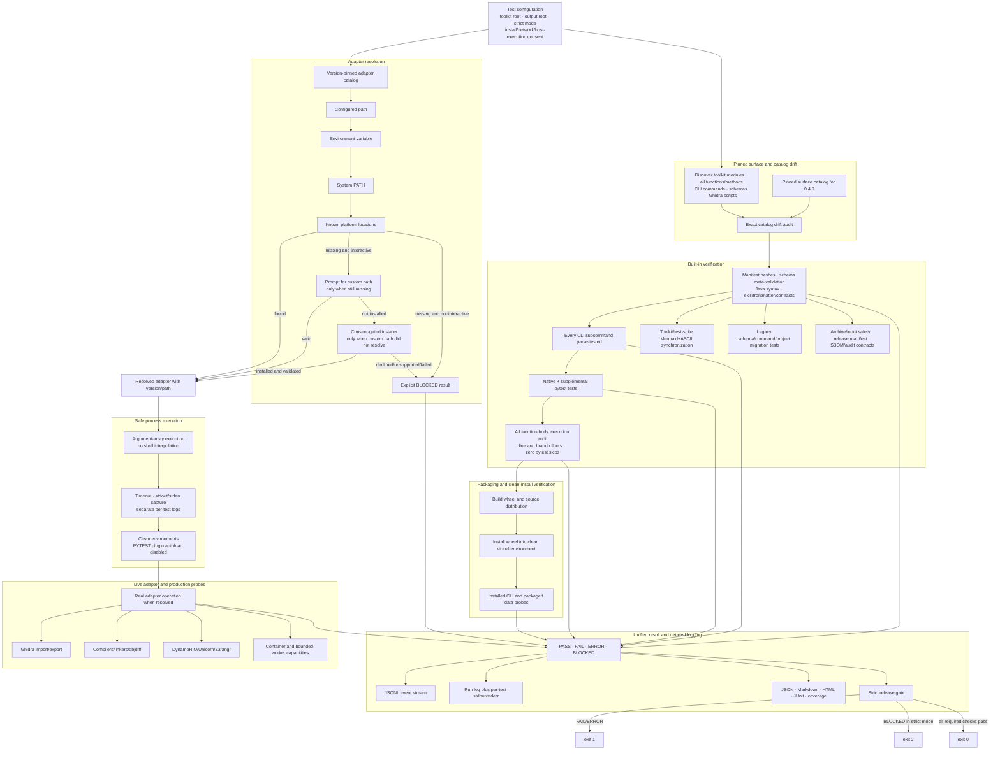
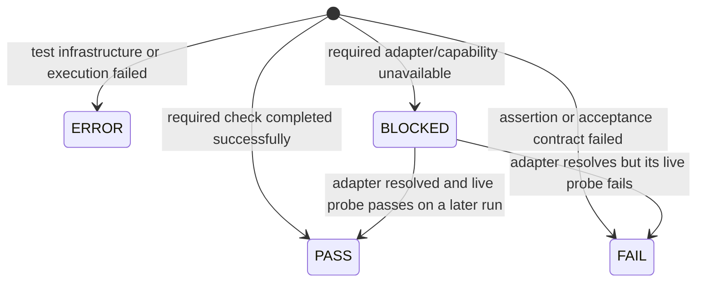
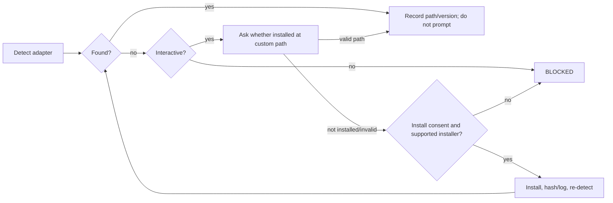

# x86decomp comprehensive test-suite architecture map

**Architecture version:** 0.4.0  
**Release contract:** no-silent-skip verification for x86decomp-toolkit 0.4.0  
**ASCII companion:** [`test-suite/docs/ARCHITECTURE_MAP_ASCII.txt`](ARCHITECTURE_MAP_ASCII.txt)  
**Toolkit map:** [`docs/ARCHITECTURE_MAP.md`](../../docs/ARCHITECTURE_MAP.md)

## Actual v0.4.0 test-suite architecture

## Result semantics

`BLOCKED` is never rewritten as `PASS`, never omitted, and causes exit code 2 in strict mode.

## Adapter prompt contract

## Maintenance contract

Update this map and `test-suite/docs/ARCHITECTURE_MAP_ASCII.txt` whenever:

- toolkit modules, functions, commands, schemas, adapters or workflow states change;
- test result semantics or strict exit codes change;
- adapter detection, custom-path prompts, installer policy or live probes change;
- test execution, coverage, packaging, migration, security or report stages change;
- the toolkit architecture maps or release version change.
