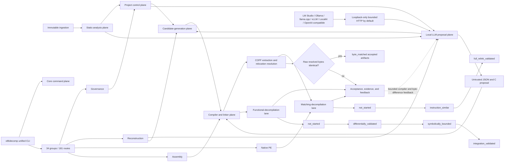

# Toolkit architecture map — 0.7.8

Plain-text companion: `docs/ARCHITECTURE_MAP_ASCII.txt`  
Verification companion: `test-suite/docs/ARCHITECTURE_MAP.md` and `test-suite/docs/ARCHITECTURE_MAP_ASCII.txt`

## Boundaries

- Immutable ingestion records artifacts before interpretation.
- Static analysis does not imply runtime behavior.
- Project control preserves evidence, audit, review, and workflow state.
- Candidate generation and local-model output produce proposals, not facts.
- Local-model endpoints are loopback-only by default; remote disclosure requires explicit profile opt-in.
- Compiler and linker evidence is preserved with exact commands and hashes.
- COFF relocations must resolve from explicit evidence before a local-model candidate can match.
- Only raw relocation-resolved byte identity can accept an `llm match` candidate.
- Matching and functional lanes remain separate.
- Acceptance requires the named verifier and durable evidence.
- The active tree contains one current command plane and no release-specific execution plane.

### v0.7.8 acceleration overlay

```mermaid
flowchart LR
  FunctionEvidence[Function packets / byte ranges] --> JobCreate[llm job-create / job-from-range]
  JobCreate --> Batch[llm batch-create / batch-match]
  Batch --> Validator[Compiler + relocation + byte validators]
  Validator --> Promote[candidate promote]
  Promote --> SourceMap[source-map annotate / verify]
  SourceMap --> HumanTree[human-readable source tree]
  HumanTree --> ModFlow[mod branch / regression compare]
```

v0.7.8 universal acceleration overlay: profile-driven function discovery, pattern recipes, text-swap workflow, source-stage/project-health accounting, GhidraMCP operations, runtime/subsystem hints, toolchain/path hygiene, and moddable-source release policy.
