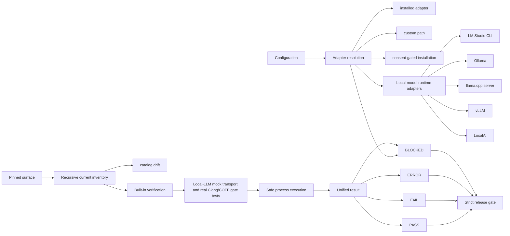
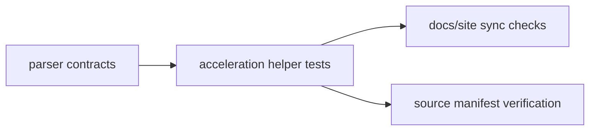

# Test-suite architecture map — 0.7.9

Toolkit map: `docs/ARCHITECTURE_MAP.md`  
Plain-text companion: `test-suite/docs/ARCHITECTURE_MAP_ASCII.txt`

The harness inventories the complete current source tree, schemas, commands, canonical routes, adapters, and function/method bodies. Local-model protocol behavior is tested with bounded loopback mock servers, while live LM Studio, Ollama, llama.cpp, vLLM, and LocalAI runtimes are detected as adapters and become explicit `BLOCKED` results when unavailable. Tests cannot be silently skipped.

### v0.7.9 acceleration verification overlay

